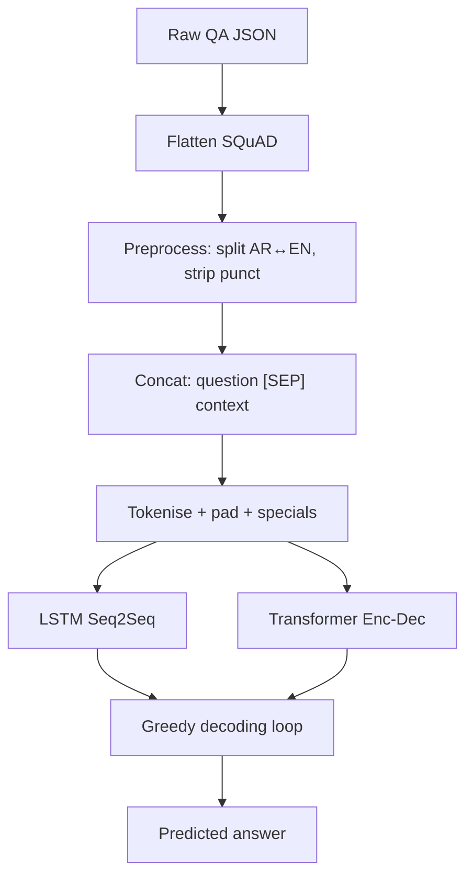

# Milestone 2 — Arabic QA: LSTM vs. Transformer

Two from-scratch neural QA models on SQuAD-style Arabic `(question, context, answer)` triplets.

## 1. Dataset & preprocessing

JSON files flattened to one row per QA: **168 train / 72 test** triplets. Both models concatenate inputs as `question [SEP] context` and predict `answer`.

- **English tokens** are kept (named entities, scientific terms appear in answers). The LSTM preprocessor also un-glues Arabic↔Latin runs (e.g. `الذرةH₂O` → two tokens) so they aren't lost as one OOV.
- **Context fusion**: early concatenation with `[SEP]`. Simpler than parallel encoders, fair across both architectures, and our context budget (≤64 tokens) doesn't justify a heavier fusion design.

## 2. Pipeline



## 3. Models

**LSTM Seq2Seq** ([ms2_LSTM.ipynb](ms2_LSTM.ipynb)): scratch embedding (dim 64) → 2-layer LSTM encoder (hidden 128) → 2-layer LSTM decoder initialised from encoder `(h, c)` → linear-to-vocab. Input length 64, target length 15 (`max_answer + 2`). Dropout 0.5, Adam `5e-4` + weight decay, grad-clip 1.0, teacher forcing 0.5 → 0.1, early stopping. Inference uses a constrained decoder that masks logits to **input tokens only** (extractive bias) and reorders selected tokens by their position in the context. Two experiments: E1 keeps train tokens with count ≥ 2 (cap 1000) → **847-token vocab**; E2 forces all answer words into the vocab — fixes a major OOV failure mode.

**Transformer encoder–decoder** ([MS2_Transformers.ipynb](MS2_Transformers.ipynb)): scratch token embedding (dim 32) + sinusoidal positional encoding → encoder (1× MHA + Add&Norm + FFN) → decoder (masked self-MHA + cross-MHA over encoder + FFN) → softmax over vocab. `max_len=30` (encoder), `max_answer_len=8` (decoder). Adam, batch 16, 40 epochs, dropout 0.1. Greedy decoding using `bstart` / `bend` markers. Satisfies the rubric: token embedding, positional encoding, **three** attention mechanisms (encoder self-, decoder masked self-, cross-), output layer.

## 4. Metrics

- **Exact Match (EM)** — normalised string equality. Strict; suits 1–2-token entity answers.
- **Token-F1** — set-based F1 over normalised tokens. Gives partial credit for "right entity, wrong function words".

BLEU/ROUGE rejected: noisy at 1–5-token lengths.

## 5. Results

| Model                          | Params  | EM (%) | F1 (%)  | Final train / val loss |
| ------------------------------ | ------- | ------ | ------- | ---------------------- |
| LSTM E1 — basic decode         | ~0.4 M  | 0.0    | 38.3    | 3.86 / 4.16            |
| LSTM E1 — ordered decode       | ~0.4 M  | 1.4    | 41.3    | 3.86 / 4.16            |
| LSTM E2 — ordered decode       | ~0.5 M  | 1.4    | 40.6    | 5.34 / 6.05 (early-stopped at epoch 13) |
| Transformer (40 epochs)        | 121 K   | 2.78   | _§10.b_ | 1.87 / 5.31            |

Plots: `loss_curve_lstm_e1.png` (cell 24), `loss_curve_lstm_e2.png` (cell 36), `transformer_curves.png` (cell 15, after re-run).

Read with care: see §8 — different splits, tokenisers, and `max_len` across the two notebooks. EM is uniformly low because answers are long free-form Arabic spans rather than the 1–2-token entities EM is designed for; F1 is the more informative metric here.

## 6. Analysis

- **Long context** — LSTM compresses to a fixed-width hidden state and we truncate at 64 tokens; answers near the end of long paragraphs fail. Transformer attends globally but is currently capped at `max_len=30`, so truncation (not architecture) is the binding limit.
- **Noise** — extra punctuation/glued AR-EN derails the LSTM hidden state cumulatively, so heavy preprocessing is essential. Transformer self-attention down-weights noise tokens and degrades more gracefully.
- **Generalisation** — both overfit within ~10–20 epochs. Mitigated with dropout, weight decay, and early stopping. The E1→E2 jump shows OOV in the answer vocabulary hurts more than capacity.
- **Attention** — Transformer cross-attention learns to look back at relevant context positions when generating each answer token. The LSTM has no learned attention; we hand-coded an inference-time input mask as a substitute (effectively hard attention).
- **Complexity vs. performance** — LSTM has more params but trains stably; Transformer is smaller and parallelisable but more LR-sensitive. With this dataset size, neither is capacity-bound — both are data-bound.
- **Adaptability** — both are generic enc-dec. Translation/summarisation = swap the data. Classification = drop the decoder, add a linear head on pooled encoder output. Span extraction (better fit for SQuAD-style data) = drop the decoder, add two pointer heads.

## 7. Inference

Both models implement `predict(question, context) → answer`.

- **LSTM** (`predict_answer_ordered`, cell 28): preprocess → encode → run encoder → loop from `<SOS>`, mask logits to input tokens excluding already-used ones, argmax, append, stop on `<EOS>`. Reorder by context position.
- **Transformer** (`decode_sequence`, cell 17): start with `bstart` token → loop up to `max_answer_len`, forward `(input, target_so_far)`, take argmax at position `i-1`, append, stop on `bend`.

Both greedy, O(L). Beam search would extend either.

## 8. Limitations

1. The two notebooks use **different splits, tokenisers, and `max_len`** — comparison numbers in §5 reflect both architecture and data partition.
2. Greedy decoding only.
3. Both models overfit on a small dataset.
4. The LSTM's input-token mask boosts EM but fails when the answer requires a token absent from the input.
5. Transformer is single-head, single-layer — meets the "≥1 attention" rubric but a deeper variant would be a fairer comparison point.
6. Transformer reports only EM by default — apply §10.b for F1.

## 9. Code ↔ diagram mapping

| Block                | LSTM (`ms2_LSTM.ipynb`)        | Transformer (`MS2_Transformers.ipynb`)     |
| -------------------- | ------------------------------ | ------------------------------------------ |
| Load + flatten       | cells 2–5                      | cells 1–2                                  |
| Preprocess           | cell 10                        | cell 4                                     |
| Tokenise + vocab     | cells 14–17                    | cell 6                                     |
| Dataset              | cell 17                        | cells 7–8                                  |
| Encoder + Decoder    | cell 19                        | cell 12                                    |
| Output head          | cell 19 (`Decoder.fc`)         | cell 12 (`Dense(V, softmax)`)              |
| Training             | cells 23, 35                   | cell 14                                    |
| Loss plot            | cells 24, 36                   | cell 15 → `transformer_curves.png`         |
| Inference            | cells 21, 28                   | cell 17                                    |
| Metrics              | cells 26, 27, 30, 38           | cell 17 (EM); §10.b adds F1                |

## 10. Notebook additions

| ID  | Change                                                  | Status     |
| --- | ------------------------------------------------------- | ---------- |
| 10.a | Capture `history`, save `transformer_curves.png`        | ✅ applied (cells 14–15); needs one re-run of the Transformer notebook to regenerate the PNG |
| 10.b | Add token-F1 to Transformer eval                        | ⏳ snippet below — append after cell 17 and re-run |
| 10.c | LSTM plots (E1, E2) extracted from existing notebook outputs and committed as `loss_curve_lstm_e1.png` / `loss_curve_lstm_e2.png` (cells 24 and 36 both `plt.savefig("loss_curve.png")`, so the saved files would overwrite each other on re-run; renamed copies were taken from the inline figures) | ✅ done — no notebook edit needed |

```python
# §10.b — append after cell 17
import re
def _norm(s): return re.sub(r"\s+", " ", re.sub(r"[^\w\s]", " ", s)).strip()
def f1_tokens(p, g):
    p, g = _norm(p).split(), _norm(g).split()
    common = set(p) & set(g)
    if not p or not g or not common: return 0.0
    prec, rec = len(common)/len(p), len(common)/len(g)
    return 2*prec*rec/(prec+rec)

f1s, ems = [], []
for i in range(len(X_test)):
    pred = decode_sequence(X_test[i:i+1])
    gt   = test_df.iloc[i]["answer"].strip()
    f1s.append(f1_tokens(pred, gt))
    ems.append(int(_norm(pred) == _norm(gt)))
print(f"Transformer EM: {sum(ems)/len(ems)*100:.1f}%")
print(f"Transformer F1: {sum(f1s)/len(f1s)*100:.1f}%")
```
